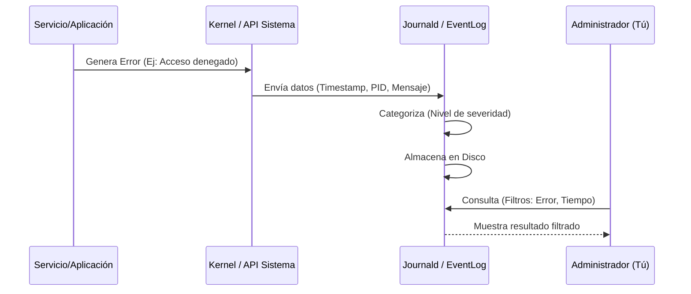

## Prerrequisitos

Para completar este laboratorio necesitas:
1.  Una máquina virtual con **Ubuntu 22.04+**.
2.  Una máquina virtual con **Windows 10/11** o **Windows Server**.
3.  Acceso con privilegios de administrador (`sudo` en Linux, `Administrator` en Windows).

## Arquitectura de un Evento de Log

Antes de empezar, visualicemos cómo viaja la información desde que ocurre un error hasta que tú lo analizas:



## Paso 1: Análisis en Windows (Visor de Eventos)

En Windows, el volumen de logs es enorme. La clave es usar **Vistas Personalizadas**.

1.  Abre el **Visor de Eventos** (`eventvwr.msc`).
2.  En el panel derecho, haz clic en **Crear vista personalizada...**.
3.  Configura el filtro:
    *   **Nivel de evento**: Marca "Crítico" y "Error".
    *   **Por registro**: Elige "Registros de Windows" -> "Sistema".
    *   **Palabras clave**: Deja en blanco para ver todo lo grave.
4.  Guárdala como `Errores_Criticos_Sistema`.

:::tip Reto Práctico
Intenta encontrar el evento con ID **6005**. Este evento indica que el servicio de registro de eventos se ha iniciado (es decir, el sistema arrancó). Es muy útil para saber cuándo se reinició un servidor por última vez.
:::

## Paso 2: Análisis en Linux (journalctl)

En Linux, el comando `journalctl` es tu mejor amigo. Olvida el uso de `cat` sobre archivos de log; el diario es mucho más potente.

### Consultas Esenciales

Para ver los errores ocurridos hoy:
```bash title="Terminal Linux"
# Filtrar por prioridad 'err' desde hoy
journalctl -p err --since today
```

Para ver los logs de un servicio específico (ej: el servidor web Apache o el servicio de red):
```bash title="Terminal Linux"
# Ver logs del servicio de red en tiempo real
journalctl -u systemd-networkd -f
```

### Detectando ataques por Fuerza Bruta
Si quieres ver quién ha intentado entrar en tu sistema sin éxito:
```bash title="Terminal Linux"
# Buscar intentos de login fallidos en el log de autenticación
journalctl _COMM=sshd | grep "Failed password"
```

## Paso 3: Análisis de un Fallo Real

Imagina que un servicio no arranca. El flujo de trabajo profesional es:
1.  Identificar el nombre del servicio que falla.
2.  Ejecutar `systemctl status nombre-servicio`.
3.  Si el error no es claro, ir al diario: `journalctl -u nombre-servicio -n 50` (ver las últimas 50 líneas).

:::info Código Comentado
```bash title="Script rápido de diagnóstico"
# Este comando muestra errores de las últimas 2 horas y los guarda en un archivo para reporte
journalctl -p 3 --since "2 hours ago" > reporte_error.txt
# El parámetro -p 3 filtra todo lo que sea Error, Crítico, Alerta o Emergencia.
```
:::
