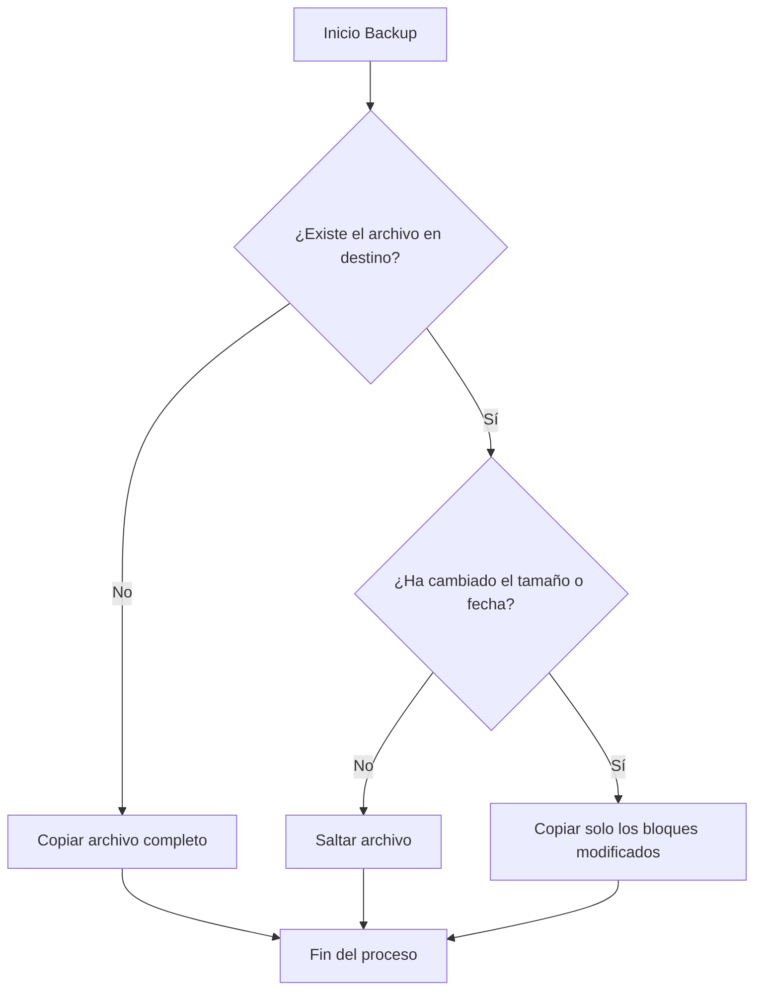

## Prerrequisitos

Para este laboratorio necesitas:
1.  Una máquina virtual con **Ubuntu** o **Debian**.
2.  Un directorio con datos de prueba (puedes crearlo con `mkdir data && touch data/file{1..10}.txt`).
3.  Un disco externo o una segunda partición montada en `/mnt/backup`.

## Flujo de una Copia Incremental

Observa cómo `rsync` decide qué archivos copiar comparando el origen y el destino:



## Paso 1: Empaquetado y Compresión con `tar`

La herramienta `tar` (Tape Archiver) es ideal para crear una "foto" de una carpeta en un solo archivo comprimido.

```bash title="Terminal Linux"
# Crear un archivo comprimido (.tar.gz) de la carpeta 'data'
# c: create, z: gzip compression, v: verbose, f: file
tar -czvf backup_usuarios_$(date +%Y%m%d).tar.gz /home/usuarios/
```

:::tip[¿Cuándo usar tar?]
Usa `tar` cuando necesites enviar una copia por correo, subirla a un servidor externo o cuando necesites guardar muchas versiones históricas ocupando el mínimo espacio posible.
:::

## Paso 2: Sincronización Eficiente con `rsync`

`rsync` es la herramienta preferida por los administradores porque solo copia los cambios, lo que ahorra ancho de banda y tiempo.

```bash title="Terminal Linux"
# Sincronizar carpeta origen con destino
# -a: archive mode (respeta permisos y enlaces)
# -v: verbose
# --delete: borra en destino lo que ya no existe en origen (espejo exacto)
rsync -av --delete /home/datos/ /mnt/backup/datos/
```

## Paso 3: Script de Automatización

Vamos a crear un script que realice una copia y genere un log del resultado.

```bash title="scripts/backup_diario.sh"
#!/bin/bash

# Configuración
SOURCE="/home/datos"
DEST="/mnt/backup/diario"
LOG="/var/log/backup_result.log"

echo "--- Inicio de backup: $(date) ---" >> $LOG

# Ejecutar rsync
rsync -av --delete $SOURCE $DEST >> $LOG 2>&1

# Comprobar si el comando anterior terminó bien (exit code 0)
if [ $? -eq 0 ]; then
    echo "¡ÉXITO! Backup completado correctamente." >> $LOG
else
    echo "¡ERROR! Algo falló durante la copia." >> $LOG
fi

echo "--- Fin de backup: $(date) ---" >> $LOG
```

:::info[Permisos del Script]
No olvides darle permisos de ejecución al script con `chmod +x backup_diario.sh` antes de programarlo en el **crontab**.
:::
